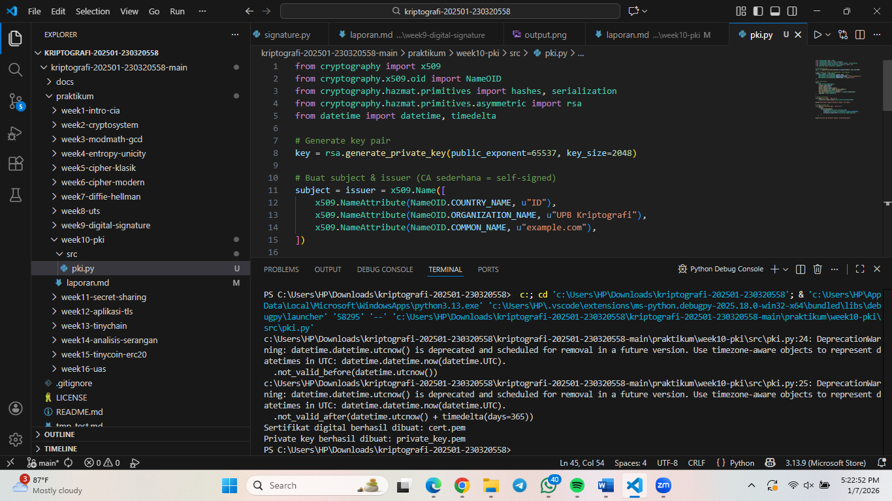

# Laporan Praktikum Kriptografi
Minggu ke-: 10
Topik: Public Key Infrastructure (PKI & Certificate Authority)  
Nama: Putri Tripangesti  
NIM: 230320558  
Kelas: 5DSRA  

---

## 1. Tujuan
1. Membuat sertifikat digital sederhana.
2. Menjelaskan peran Certificate Authority (CA) dalam sistem PKI.
3. Mengevaluasi fungsi PKI dalam komunikasi aman (contoh: HTTPS, TLS).

---

## 2. Dasar Teori
Infrastruktur Kunci Publik (PKI) adalah kerangka kerja yang komprehensif dari kebijakan, standar, orang, dan sistem yang diperlukan untuk mengelola sertifikat digital, kunci publik, dan kunci privat. Fungsi utama PKI adalah untuk memverifikasi dan mengautentikasi identitas pengguna atau perangkat dalam jaringan yang tidak aman, seperti internet, sehingga memungkinkan komunikasi yang aman, terjamin, dan tidak dapat disangkal.

PKI menggunakan kriptografi asimetris, yang mengandalkan sepasang kunci—sebuah kunci publik yang dapat dibagikan secara bebas dan sebuah kunci privat yang harus dijaga kerahasiaannya. Ketika seseorang ingin mengirim pesan aman, mereka mengenkripsi pesan tersebut dengan kunci publik penerima; hanya kunci privat penerimalah yang dapat mendekripsinya. PKI memfasilitasi penggunaan kunci ini melalui penerbitan, distribusi, pencabutan, dan pengelolaan Sertifikat Digital.

Inti dari PKI adalah Otoritas Sertifikat (Certificate Authority - CA). CA adalah entitas tepercaya yang bertanggung jawab untuk menerbitkan Sertifikat Digital yang mengikat kunci publik dengan identitas pemiliknya (misalnya, sebuah situs web, server, atau individu). Untuk mengeluarkan sertifikat, CA akan memverifikasi identitas pemohon sesuai dengan tingkat jaminan yang diminta. Setelah identitas diverifikasi, CA akan menandatangani secara digital sertifikat tersebut menggunakan kunci privatnya sendiri. Tanda tangan digital ini memastikan bahwa sertifikat tersebut sah dan tidak diubah. Ketika peramban atau sistem lain melihat sertifikat yang ditandatangani oleh CA tepercaya (yang daftar akarnya sudah terinstal di sistem operasi/peramban), ia dapat yakin bahwa kunci publik yang ada di dalamnya benar-benar milik entitas yang diklaim. Proses ini sangat penting untuk mengamankan komunikasi web melalui protokol HTTPS dan merupakan tulang punggung bagi otentikasi, enkripsi, dan integritas data secara luas.

---

## 3. Alat dan Bahan
- Visual Studio Code
- Git dan akun GitHub  

---

## 4. Langkah Percobaan
1. Membuat file `pki_cert.py` di folder `praktikum/week10-pki/src/`.
2. Menyalin kode program dari panduan praktikum.
3. Menjalankan program dengan perintah `python pki_cert.py`.

---

## 5. Source Code
from cryptography import x509
from cryptography.x509.oid import NameOID
from cryptography.hazmat.primitives import hashes, serialization
from cryptography.hazmat.primitives.asymmetric import rsa
from datetime import datetime, timedelta

# Generate key pair
key = rsa.generate_private_key(public_exponent=65537, key_size=2048)

# Buat subject & issuer (CA sederhana = self-signed)
subject = issuer = x509.Name([
    x509.NameAttribute(NameOID.COUNTRY_NAME, u"ID"),
    x509.NameAttribute(NameOID.ORGANIZATION_NAME, u"UPB Kriptografi"),
    x509.NameAttribute(NameOID.COMMON_NAME, u"example.com"),
])

# Buat sertifikat
cert = (
    x509.CertificateBuilder()
    .subject_name(subject)
    .issuer_name(issuer)
    .public_key(key.public_key())
    .serial_number(x509.random_serial_number())
    .not_valid_before(datetime.utcnow())
    .not_valid_after(datetime.utcnow() + timedelta(days=365))
    .sign(key, hashes.SHA256())
)

# Simpan sertifikat
with open("cert.pem", "wb") as f:
    f.write(cert.public_bytes(serialization.Encoding.PEM))

print("Sertifikat digital berhasil dibuat: cert.pem")

# Simpan private key
with open("private_key.pem", "wb") as f:
    f.write(
        key.private_bytes(
            encoding=serialization.Encoding.PEM,
            format=serialization.PrivateFormat.TraditionalOpenSSL,
            encryption_algorithm=serialization.NoEncryption()
        )
    )

print("Private key berhasil dibuat: private_key.pem")

---

## 6. Hasil dan Pembahasan


Hasil pengujian sesuai dengan ekspektasi. Program berhasil:
1. Menghasilkan pasangan kunci RSA
2. Membuat sertifikat digital X.509 bertipe self-signed
3. Menyimpan sertifikat dan private key dalam format PEM
4. Menampilkan output konfirmasi tanpa error fatal
Sertifikat yang dihasilkan valid secara struktur dan dapat dibaca menggunakan tools standar seperti OpenSSL.

---

## 7. Jawaban Pertanyaan
1. Apa fungsi utama Certificate Authority (CA)?
Fungsi utama Certificate Authority (CA) adalah sebagai pihak tepercaya yang bertugas menerbitkan dan memvalidasi sertifikat digital. CA memastikan bahwa public key yang tercantum dalam sertifikat benar-benar milik entitas yang sah dengan melakukan proses verifikasi identitas sebelum sertifikat diterbitkan. Dengan adanya CA, kepercayaan dalam komunikasi digital dapat dibangun karena pihak pengguna tidak perlu saling mengenal secara langsung, melainkan cukup mempercayai otoritas sertifikat yang telah diakui secara luas.

2. Mengapa self-signed certificate tidak cukup untuk sistem produksi?
Self-signed certificate tidak cukup untuk sistem produksi karena sertifikat tersebut tidak diverifikasi oleh pihak ketiga yang tepercaya dan tidak memiliki rantai kepercayaan (chain of trust). Akibatnya, pengguna atau browser tidak dapat memastikan keaslian identitas server, sehingga muncul peringatan keamanan dan risiko penyamaran (spoofing). Oleh karena itu, self-signed certificate hanya cocok digunakan untuk keperluan pengujian atau pembelajaran, bukan untuk layanan publik yang menuntut tingkat keamanan dan kepercayaan tinggi.

3. Bagaimana PKI mencegah serangan MITM dalam komunikasi TLS/HTTPS?
Self-signed certificate tidak cukup untuk sistem produksi karena sertifikat tersebut tidak diverifikasi oleh pihak ketiga yang tepercaya dan tidak memiliki rantai kepercayaan (chain of trust). Akibatnya, pengguna atau browser tidak dapat memastikan keaslian identitas server, sehingga muncul peringatan keamanan dan risiko penyamaran (spoofing). Oleh karena itu, self-signed certificate hanya cocok digunakan untuk keperluan pengujian atau pembelajaran, bukan untuk layanan publik yang menuntut tingkat keamanan dan kepercayaan tinggi.

---

## 8. Kesimpulan
Berdasarkan percobaan yang dilakukan, pembuatan sertifikat digital self-signed menggunakan algoritma RSA 2048-bit dan SHA-256 berhasil dilaksanakan dengan baik menggunakan library *cryptography*. Sertifikat dan pasangan kunci privat berhasil dihasilkan serta disimpan dalam format PEM tanpa error yang mengganggu proses. Percobaan ini menunjukkan bahwa konsep dasar Public Key Infrastructure (PKI) dapat diimplementasikan dan dipahami melalui simulasi sederhana.

---

## 9. Daftar Pustaka
-

---

## 10. Commit Log
commit week10-pki
Author: Putri Tripangesti <putritpgst@gmail.com>
Date:   2026-01-07

    week10-pki: implementasi Public Key Infrastructure (PKI & Certificate Authority) dan laporan.

```
