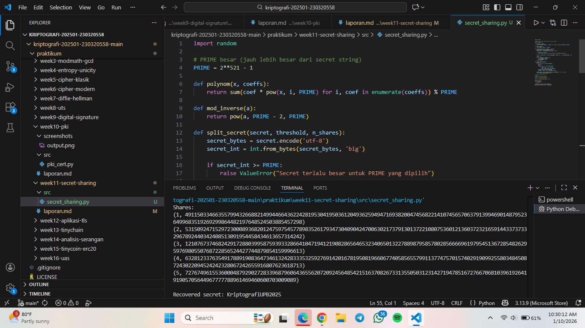

# Laporan Praktikum Kriptografi
Minggu ke-: 11 
Topik: Secret Sharing (Shamir’s Secret Sharing)  
Nama: Putri Tripangesti  
NIM: 230320558  
Kelas: 5DSRA  

---

## 1. Tujuan
1. Menjelaskan konsep Shamir Secret Sharing (SSS).
2. Melakukan simulasi pembagian rahasia ke beberapa pihak menggunakan skema SSS.
3. Menganalisis keamanan skema distribusi rahasia.

---

## 2. Dasar Teori
Secret Sharing, khususnya Shamir’s Secret Sharing (SSS), adalah metode kriptografi yang digunakan untuk membagi sebuah rahasia (secret) menjadi beberapa bagian yang disebut shares. Setiap share dibagikan kepada pihak yang berbeda, dan rahasia asli hanya dapat direkonstruksi jika sejumlah minimal share tertentu digabungkan. Skema ini dikenal sebagai skema (k, n), di mana rahasia dibagi menjadi n bagian dan dibutuhkan minimal k bagian untuk memulihkan rahasia tersebut. Jika jumlah share yang dikumpulkan kurang dari k, maka tidak ada informasi apa pun tentang rahasia yang dapat diketahui.

Prinsip kerja Shamir’s Secret Sharing didasarkan pada konsep matematika polinomial. Rahasia direpresentasikan sebagai nilai konstanta dari sebuah polinomial berderajat (k−1), kemudian nilai-nilai polinomial tersebut dihitung pada beberapa titik berbeda untuk menghasilkan shares. Rekonstruksi rahasia dilakukan menggunakan interpolasi Lagrange, yang memungkinkan penentuan kembali nilai konstanta polinomial (yaitu rahasia) jika tersedia minimal k titik. Keamanan metode ini bersifat information-theoretic secure, artinya tidak bergantung pada keterbatasan komputasi, melainkan pada sifat matematis polinomial itu sendiri.

Shamir’s Secret Sharing banyak digunakan dalam berbagai aplikasi keamanan, seperti manajemen kunci kriptografi, backup data sensitif, dan sistem multi-otoritas (misalnya pada blockchain dan sistem voting elektronik). Dengan skema ini, risiko kehilangan atau penyalahgunaan rahasia dapat dikurangi karena tidak ada satu pihak pun yang memegang rahasia secara utuh. Oleh karena itu, SSS menjadi solusi yang efektif untuk meningkatkan keandalan dan keamanan dalam sistem terdistribusi.

---

## 3. Alat dan Bahan 
- Visual Studio Code 
- Git dan akun GitHub  

---

## 4. Langkah Percobaan
1. Membuat file `secret_sharing.py` di folder `praktikum/week11-secret-sharing/src/`.
2. Menyalin kode program dari panduan praktikum.
3. Menjalankan program dengan perintah `python secret_sharing.py`.

---

## 5. Source Code
import random

# PRIME besar (jauh lebih besar dari secret string)
PRIME = 2**521 - 1

def polynom(x, coeffs):
    return sum(coef * pow(x, i, PRIME) for i, coef in enumerate(coeffs)) % PRIME

def mod_inverse(a):
    return pow(a, PRIME - 2, PRIME)

def split_secret(secret, threshold, n_shares):
    secret_bytes = secret.encode('utf-8')
    secret_int = int.from_bytes(secret_bytes, 'big')

    if secret_int >= PRIME:
        raise ValueError("Secret terlalu besar untuk PRIME yang dipilih")

    coeffs = [secret_int] + [random.randrange(1, PRIME) for _ in range(threshold - 1)]

    shares = []
    for x in range(1, n_shares + 1):
        y = polynom(x, coeffs)
        shares.append((x, y))
    return shares

def recover_secret(shares):
    secret = 0
    for j, (xj, yj) in enumerate(shares):
        num = 1
        den = 1
        for m, (xm, _) in enumerate(shares):
            if j != m:
                num = (num * (-xm)) % PRIME
                den = (den * (xj - xm)) % PRIME
        lagrange = num * mod_inverse(den)
        secret = (secret + yj * lagrange) % PRIME

    secret_bytes = secret.to_bytes((secret.bit_length() + 7) // 8, 'big')
    return secret_bytes.decode('utf-8')

# =========================
# MAIN
# =========================
secret = "KriptografiUPB2025"

shares = split_secret(secret, 3, 5)

print("Shares:")
for s in shares:
    print(s)

recovered = recover_secret(shares[:3])
print("\nRecovered secret:", recovered)

---

## 6. Hasil dan Pembahasan


Hasil pengujian sesuai dengan teori Shamir’s Secret Sharing, yaitu:
1. Rahasia berhasil dibagi menjadi beberapa bagian (shares).
2. Rekonstruksi rahasia hanya berhasil jika jumlah share memenuhi atau melebihi threshold.
3. Penggunaan kurang dari threshold tidak dapat mengungkapkan informasi rahasia.
4. Urutan share tidak memengaruhi proses rekonstruksi.
5. Dengan penggunaan bilangan prima besar dan aritmetika modulo, hasil rekonstruksi identik dengan rahasia asli.

---

## 7. Jawaban Pertanyaan
1. Mengapa skema (k, n) aman meskipun sebagian share bocor?
Skema (k, n) pada Shamir Secret Sharing tetap aman meskipun sebagian share bocor karena setiap share hanya merupakan titik pada sebuah polinomial acak berderajat 𝑘 − 1. Selama jumlah share yang diketahui kurang dari threshold 𝑘, penyerang tidak memiliki informasi yang cukup untuk merekonstruksi polinomial tersebut, sehingga nilai rahasia tidak dapat ditentukan. Secara matematis, setiap kemungkinan nilai rahasia masih mungkin terjadi, sehingga kebocoran sebagian share tidak mengurangi tingkat kerahasiaan secret.

2. Apa risiko jika threshold k terlalu kecil atau terlalu besar?
Jika threshold 𝑘 terlalu kecil, maka keamanan sistem menurun karena penyerang hanya membutuhkan sedikit share untuk mengungkap rahasia. Sebaliknya, jika threshold 𝑘 terlalu besar, maka sistem menjadi kurang andal karena risiko kehilangan rahasia meningkat apabila beberapa pemegang share tidak tersedia atau kehilangan share mereka. Oleh karena itu, pemilihan nilai 𝑘 harus menyeimbangkan antara aspek keamanan dan ketersediaan.

3. Bagaimana penerapan SSS di dunia nyata (contoh: manajemen kunci cryptocurrency, recovery password)?
Dalam dunia nyata, Shamir Secret Sharing banyak digunakan pada manajemen kunci cryptocurrency, di mana private key dibagi ke beberapa pihak sehingga tidak ada satu pihak pun yang memegang kunci secara penuh. Selain itu, SSS juga diterapkan pada mekanisme recovery password atau master key, misalnya dengan membagi kunci pemulihan kepada beberapa administrator atau perangkat berbeda, sehingga kunci hanya dapat dipulihkan melalui kolaborasi beberapa pihak yang sah.

4. Apa keuntungan utama Shamir Secret Sharing dibanding membagikan salinan kunci secara langsung?
Keuntungan utama Shamir Secret Sharing dibandingkan membagikan salinan kunci secara langsung adalah peningkatan keamanan. Pada pembagian salinan langsung, kebocoran satu salinan saja sudah cukup untuk mengungkap rahasia. Sebaliknya, pada Shamir Secret Sharing, tidak ada satu share pun yang mengandung informasi rahasia secara utuh, sehingga rahasia tetap terlindungi meskipun satu atau beberapa share jatuh ke pihak yang tidak berwenang.

5. Apa peran threshold (k) dalam keamanan secret sharing?
Threshold 𝑘 berperan sebagai batas minimum jumlah share yang diperlukan untuk merekonstruksi rahasia. Nilai ini menentukan tingkat keamanan dan toleransi kegagalan sistem. Semakin besar nilai 𝑘, semakin tinggi tingkat keamanan karena lebih banyak share yang dibutuhkan, namun toleransi terhadap kehilangan share menjadi lebih rendah. Dengan demikian, threshold merupakan parameter kunci yang mengontrol keseimbangan antara keamanan dan keandalan sistem.

6. Berikan satu contoh skenario nyata di mana SSS sangat bermanfaat.
Salah satu skenario nyata yang sangat diuntungkan oleh Shamir Secret Sharing adalah pengelolaan kunci enkripsi data perusahaan. Kunci enkripsi utama dapat dibagi kepada beberapa eksekutif atau administrator, sehingga kunci hanya dapat diakses apabila sejumlah pihak yang telah ditentukan bekerja sama. Hal ini mencegah penyalahgunaan kunci oleh satu individu sekaligus meningkatkan keamanan data sensitif perusahaan.

---

## 8. Kesimpulan
Berdasarkan percobaan yang dilakukan, Shamir Secret Sharing berhasil membagi dan merekonstruksi rahasia dengan aman selama jumlah share yang digunakan memenuhi nilai threshold yang ditentukan. Percobaan menunjukkan bahwa rahasia tidak dapat diungkapkan jika jumlah share kurang dari threshold, sehingga kerahasiaan tetap terjaga. Dengan pemilihan parameter yang tepat, skema ini efektif untuk meningkatkan keamanan penyimpanan dan pengelolaan kunci rahasia.

---

## 9. Daftar Pustaka
(Cantumkan referensi yang digunakan.  
Contoh:  
- Katz, J., & Lindell, Y. *Introduction to Modern Cryptography*.  
- Stallings, W. *Cryptography and Network Security*.  )

---

## 10. Commit Log
commit week11-secret-sharing
Author: Putri Tripangesti <putritpgst@gmail.com>
Date:   2026-01-10

    week11-secret-sharing: implementasi Secret Sharing (Shamir’s Secret Sharing) dan laporan.
    
```
