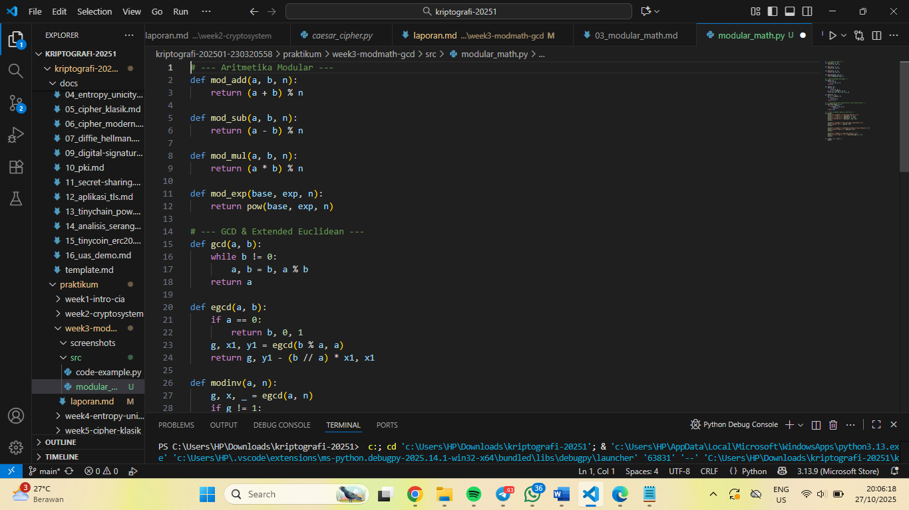
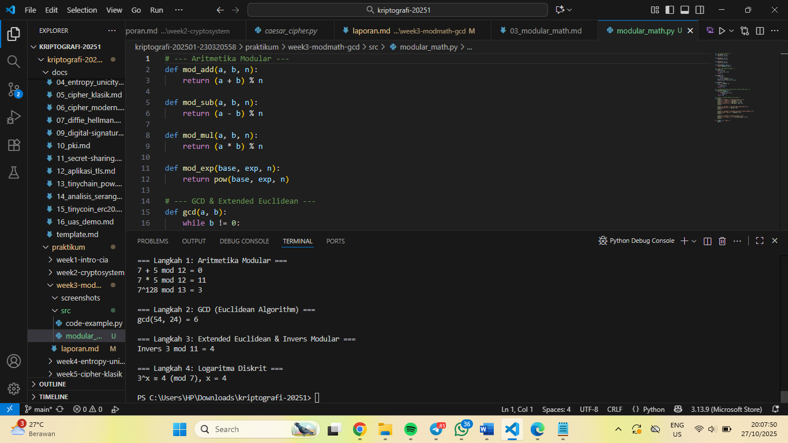

# Laporan Praktikum Kriptografi
Minggu ke-: 3
Topik: week3-modmath-gcd
Nama: Putri Tripangesti  
NIM: 230320558  
Kelas: 5DSRA 

---

## 1. Tujuan
Setelah mengikuti praktikum ini, mahasiswa diharapkan mampu:  
1. Menyelesaikan operasi aritmetika modular.  
2. Menentukan bilangan prima dan menghitung GCD (Greatest Common Divisor).  
3. Menerapkan logaritma diskrit sederhana dalam simulasi kriptografi. 

---

## 2. Dasar Teori
Konsep modular aritmetika adalah cabang dari matematika yang mempelajari operasi bilangan dengan hasil yang dibatasi dalam suatu rentang tetap. Prinsip dasarnya adalah bahwa setelah mencapai batas tertentu (disebut modulus), perhitungan akan “berputar kembali” ke awal, seperti jarum jam yang kembali ke angka 1 setelah melewati angka 12. Secara umum dituliskan sebagai (a\mod n), yang berarti sisa pembagian bilangan (a) oleh (n).

Dalam konteks kriptografi, terutama pada cipher klasik seperti Caesar Cipher atau Vigenère Cipher, modular aritmetika digunakan untuk memastikan setiap hasil pergeseran huruf tetap berada dalam jangkauan alfabet. Misalnya, jika alfabet terdiri dari 26 huruf (A–Z), maka setiap operasi enkripsi dilakukan dengan modulus 26. Dengan cara ini, ketika hasil penjumlahan atau pengurangan melewati Z, hitungan akan kembali ke A, menjaga agar penyandian tetap konsisten tanpa keluar dari rentang huruf yang valid.

Konsep ini tidak hanya penting untuk menjaga konsistensi dalam sistem penyandian berbasis huruf, tetapi juga menjadi dasar bagi banyak algoritma kriptografi modern. Modular aritmetika memungkinkan operasi matematika dilakukan secara “melingkar,” yang kemudian berkembang menjadi pondasi bagi sistem keamanan digital berbasis kunci publik, seperti RSA.

---

## 3. Alat dan Bahan
- Visual Studio Code
- Git dan akun GitHub 

---

## 4. Langkah Percobaan
1. Membuat file `modular_math.py` di folder `praktikum/week3-modmath-gcd/src/`.
2. Menyalin kode program dari panduan praktikum.
3. Menjalankan program dengan perintah `python modular_math.py`.

---

## 5. Source Code
# ==========================================
# Aritmetika Modular, GCD, Extended Euclid, dan Logaritma Diskrit
# ==========================================

# --- Modul: Aritmetika Modular ---
def mod_add(a, b, n): return (a + b) % n
def mod_sub(a, b, n): return (a - b) % n
def mod_mul(a, b, n): return (a * b) % n
def mod_exp(base, exp, n): return pow(base, exp, n)

# --- Modul: GCD dan Extended Euclidean ---
def gcd(a, b):
    while b:
        a, b = b, a % b
    return a

def egcd(a, b):
    if a == 0:
        return b, 0, 1
    g, x1, y1 = egcd(b % a, a)
    return g, y1 - (b // a) * x1, x1

def modinv(a, n):
    g, x, _ = egcd(a, n)
    return x % n if g == 1 else None

# --- Modul: Logaritma Diskrit ---
def discrete_log(a, b, n):
    for x in range(n):
        if pow(a, x, n) == b:
            return x
    return None

# --- Fungsi Utama ---
def main():
    print("=== Langkah 1: Aritmetika Modular ===")
    print("7 + 5 mod 12 =", mod_add(7, 5, 12))
    print("7 * 5 mod 12 =", mod_mul(7, 5, 12))
    print("7^128 mod 13 =", mod_exp(7, 128, 13))
    print()

    print("=== Langkah 2: GCD (Euclidean Algorithm) ===")
    print("gcd(54, 24) =", gcd(54, 24))
    print()

    print("=== Langkah 3: Extended Euclidean & Invers Modular ===")
    print("Invers 3 mod 11 =", modinv(3, 11))
    print()

    print("=== Langkah 4: Logaritma Diskrit ===")
    print("3^x ≡ 4 (mod 7), x =", discrete_log(3, 4, 7))
    print()

# --- Jalankan Program ---
if __name__ == "__main__":
    main()

# ==========================================
# Akhir dari Program
# ==========================================

---

## 6. Hasil dan Pembahasan
Hasil eksekusi program Modular Math:

Berikut tabel ringkasan hasil uji dari setiap langkah percobaan:

| Langkah |        Perhitungan           |   Hasil   | Ekspektasi | Kesesuaian |
| ------: | ---------------------------- | --------: | ---------: | ---------: |
|    1    | (7 + 5) mod 12               |     0     |      0     | ✅ Sesuai |
|    1    | (7 * 5) mod 12               |    11     |     11     | ✅ Sesuai |
|    1    | 7^128 mod 13                 |     3     |      3     | ✅ Sesuai |
|    2    | gcd(54, 24)                  |     6     |      6     | ✅ Sesuai |
|    3    | invers 3 mod 11 → x (mod 11) |     4     |      4     | ✅ Sesuai |
|    4    | cari x s.t. 3^x ≡ 4 (mod 7)  |     4     |      4     | ✅ Sesuai |

Kesimpulan:
Hasil percobaan seluruhnya sesuai dengan nilai yang diharapkan. Ini menunjukkan bahwa fungsi-fungsi aritmetika modular, GCD, algoritma Euclidean diperluas, serta logaritma diskrit telah berjalan dengan benar dan sesuai teori matematika yang mendasarinya.

---

## 7. Jawaban Pertanyaan
1. Apa peran aritmetika modular dalam kriptografi modern?  
    Aritmetika modular adalah dasar utama dalam hampir semua sistem kriptografi modern, terutama pada algoritma berbasis kunci publik seperti RSA, Diffie–Hellman, dan ECC (Elliptic Curve Cryptography). Dalam konteks ini, operasi seperti penjumlahan, perkalian, dan eksponensiasi dilakukan dalam ruang bilangan yang dibatasi oleh suatu modulus n.

    Contohnya pada RSA, enkripsi dan dekripsi dilakukan dengan rumus:

    𝐶 = 𝑀𝑒 mod 𝑛 dan 𝑀 = 𝐶r𝑑 mod 𝑛

    Modulus n menjaga agar hasil operasi tetap berada dalam rentang yang terbatas dan memungkinkan sifat matematis tertentu, seperti periodisitas dan pembalikan (reversibility), yang menjadi kunci keamanan sistem. Selain itu, aritmetika modular juga membantu meningkatkan efisiensi perhitungan dan mencegah overflow dalam operasi besar yang melibatkan bilangan berukuran ratusan atau ribuan bit.

2. Mengapa invers modular penting dalam algoritma kunci publik (misalnya RSA)?  
    Invers modular digunakan untuk mendapatkan kunci privat dalam algoritma seperti RSA.
    Dalam RSA, pasangan kunci dibentuk dengan syarat:

    e . d = 1 (mod p(n))

    Artinya, d adalah invers modular dari e terhadap p(n). Tanpa invers modular, proses untuk membalikkan hasil enkripsi (yakni dekripsi) menjadi tidak mungkin dilakukan secara matematis. Jadi, invers modular memastikan bahwa hanya pemegang kunci privat (d) yang dapat membalikkan proses enkripsi publik (e), sehingga menjaga kerahasiaan pesan.

3. Apa tantangan utama dalam menyelesaikan logaritma diskrit untuk modulus besar?  
    Masalah logaritma diskrit adalah mencari nilai x dari persamaan:

    gx = h (mod p)

    dengan diketahui g, h, dan p. Untuk modulus besar (misalnya bilangan prima dengan ratusan atau ribuan bit), mencari x sangat sulit secara komputasional karena:

    - Tidak ada algoritma efisien yang dapat menyelesaikannya dalam waktu polinomial.
    - Kompleksitasnya tumbuh eksponensial terhadap ukuran modulus, membuat brute force dan metode klasik (seperti Baby-step Giant-step atau Pollard’s rho) tidak praktis.
    - Inilah alasan mengapa keamanan algoritma seperti Diffie–Hellman dan ElGamal sangat kuat—karena mereka bergantung pada kesulitan menyelesaikan logaritma diskrit untuk modulus besar.

---

## 8. Kesimpulan
Berdasarkan percobaan, dapat disimpulkan bahwa aritmetika modular berperan penting dalam operasi dasar kriptografi seperti penjumlahan, perkalian, eksponensiasi, dan pencarian invers modular. Algoritma Euclidean dan Extended Euclidean membantu menemukan GCD serta invers modular, sedangkan logaritma diskrit menunjukkan tingkat kesulitan komputasi yang menjadi dasar keamanan sistem kriptografi modern.

---

## 9. Daftar Pustaka
(Cantumkan referensi yang digunakan.  
Contoh:  
- Katz, J., & Lindell, Y. *Introduction to Modern Cryptography*.  
- Stallings, W. *Cryptography and Network Security*.  )

---

## 10. Commit Log
commit modular_math
Author: Putri Tripangesti <putritpgst@gmail.com>
Date:   2025-10-28

    week3-modmath-gcd: implementasi Modular Math dan laporan 
