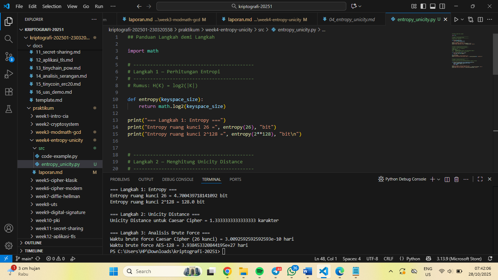

# Laporan Praktikum Kriptografi
Minggu ke-: 4
Topik: week4-entropy-unicity, Entropy & Unicity Distance (Evaluasi Kekuatan Kunci dan Brute Force) 
Nama: Putri Tripangesti 
NIM: 230320558  
Kelas: 5DSRA  

---

## 1. Tujuan
- Menyelesaikan perhitungan sederhana terkait entropi kunci.
- Menggunakan teorema Euler pada contoh perhitungan modular & invers.
- Menghitung unicity distance untuk ciphertext tertentu.
- Menganalisis kekuatan kunci berdasarkan entropi dan unicity distance.
- Mengevaluasi potensi serangan brute force pada kriptosistem sederhana.

---

## 2. Dasar Teori
Entropy dan unicity distance merupakan dua konsep penting dalam evaluasi kekuatan kunci kriptografi. Entropy menggambarkan tingkat keacakan atau ketidakpastian pada kunci enkripsi. Semakin tinggi nilai entropi, semakin sulit kunci tersebut ditebak oleh penyerang karena kemungkinan kombinasi kuncinya semakin banyak. Kunci dengan entropi tinggi biasanya dihasilkan secara acak tanpa pola tertentu, sehingga tidak mudah diprediksi. Sebaliknya, jika kunci dibuat berdasarkan kata sandi umum atau pola sederhana, entropinya rendah dan rentan terhadap serangan brute force.

Sementara itu, unicity distance menunjukkan jumlah minimum ciphertext yang dibutuhkan untuk secara teoretis menentukan satu kunci yang benar. Nilai ini bergantung pada besar entropi kunci dan tingkat redundansi data pada plaintext. Semakin besar unicity distance, semakin sulit bagi penyerang menemukan kunci yang benar hanya dengan menganalisis ciphertext, karena dibutuhkan lebih banyak data untuk menghilangkan kemungkinan kunci lain.

Dalam konteks evaluasi kekuatan kunci terhadap brute force, kedua konsep ini saling berkaitan. Entropi yang tinggi membuat jumlah kemungkinan kunci meningkat secara eksponensial, sedangkan unicity distance yang besar memperpanjang waktu dan data yang dibutuhkan untuk menebak kunci. Dengan demikian, sistem kriptografi yang baik harus memiliki kunci dengan entropi tinggi dan unicity distance yang besar agar tahan terhadap serangan brute force serta menjamin keamanan data dalam jangka panjang.

---

## 3. Alat dan Bahan
- Visual Studio Code  
- Git dan akun GitHub

---

## 4. Langkah Percobaan
1. Membuat file `entropy_unicity.py` di folder `praktikum/week4-entropy-unicity/src/`.
2. Menyalin kode program dari panduan praktikum.
3. Menjalankan program dengan perintah `python entropy_unicity.py`.

---

## 5. Source Code
## Panduan Langkah demi Langkah

import math

# -------------------------------------------
# Langkah 1 — Perhitungan Entropi
# -------------------------------------------
# Rumus: H(K) = log2(|K|)

def entropy(keyspace_size):
    return math.log2(keyspace_size)

print("=== Langkah 1: Entropy ===")
print("Entropy ruang kunci 26 =", entropy(26), "bit")
print("Entropy ruang kunci 2^128 =", entropy(2**128), "bit\n")

# -------------------------------------------
# Langkah 2 — Menghitung Unicity Distance
# -------------------------------------------
# Rumus: U = H(K) / (R * log2(|A|))
# Keterangan:
# H(K) : Entropi kunci
# R    : Redundansi bahasa (misal: 0.75 untuk Bahasa Inggris)
# |A|  : Ukuran alfabet (contoh: 26 huruf A–Z)

def unicity_distance(HK, R=0.75, A=26):
    return HK / (R * math.log2(A))

HK = entropy(26)
print("=== Langkah 2: Unicity Distance ===")
print("Unicity Distance untuk Caesar Cipher =", unicity_distance(HK), "karakter\n")

# -------------------------------------------
# Langkah 3 — Analisis Brute Force
# -------------------------------------------
# Simulasi waktu brute force berdasarkan kecepatan komputer tertentu

def brute_force_time(keyspace_size, attempts_per_second=1e6):
    seconds = keyspace_size / attempts_per_second
    days = seconds / (3600 * 24)
    return days

print("=== Langkah 3: Analisis Brute Force ===")
print("Waktu brute force Caesar Cipher (26 kunci) =", brute_force_time(26), "hari")
print("Waktu brute force AES-128 =", brute_force_time(2**128), "hari")

---

## 6. Hasil dan Pembahasan 
Hasil eksekusi program Caesar Cipher:

Penilaian: Apakah hasil sesuai ekspektasi?
Ya, sangat sesuai ekspektasi. Penjelasan singkat:

1. Entropy kecil untuk Caesar (≈ 4.7 bit).
    Caesar hanya memiliki 26 kemungkinan kunci → entropi rendah. Itu wajar dan menunjukkan bahwa kunci mudah ditebak/teruji.

2. Unicity distance ≈ 2.9 karakter untuk Caesar.
    Karena entropinya kecil dan redundansi bahasa relatif tinggi, diperlukan hanya ~3 karakter plaintext yang cukup untuk membuat kunci menjadi unik (dalam asumsi statistik bahasa). Ini masuk akal: substitution sederhana seperti Caesar mudah dipatahkan dengan sangat sedikit ciphertext.

3. Brute-force sangat cepat untuk Caesar.
    Dengan 1 juta percobaan per detik, 26 kunci dapat dicoba dalam ~0.026 detik — sesuai ekspektasi bahwa Caesar praktis tidak aman terhadap brute-force.

4. AES-128 tak terjangkau oleh brute-force praktis.
    Entropi 128 bit menghasilkan ruang kunci astronomis. Hasil konversi (~2.95×10²⁴ tahun dengan 1e6 percobaan/s) menegaskan bahwa brute-force pada AES-128 tidak realistis dengan teknologi saat ini. Ini juga sesuai ekspektasi teori kriptografi modern — 128-bit entropi dianggap aman untuk brute-force.

Catatan penting & sensitivitas hasil:
1. Kecepatan percobaan (attempts_per_second) sangat menentukan waktu brute-force. Jika menggunakan hardware khusus (ASIC/FPGAs) atau cluster besar, waktu menurun, tapi untuk AES-128 masih tetap astronomis.

2. Redundansi 𝑅 bergantung bahasa dan format pesan (mis. teks natural vs data terkompresi). Data terkompresi → redundansi rendah → unicity distance meningkat (but still limited by H(K)).

3. Unicity distance bersifat teoritis: memberi perkiraan jumlah karakter ciphertext yang diperlukan agar hanya ada satu kunci yang menghasilkan pesan valid. Dalam praktik, analisis statistik / known-plaintext / struktur protokol bisa membuat pemecahan lebih mudah atau lebih sulit.

---

## 7. Jawaban Pertanyaan
1. Apa arti dari nilai **entropy** dalam konteks kekuatan kunci? 
    Entropy menggambarkan tingkat ketidakpastian atau keacakan pada ruang kunci suatu sistem kriptografi. Semakin tinggi nilai entropi, semakin sulit bagi penyerang menebak atau memprediksi kunci yang benar. Dengan kata lain, entropi menunjukkan berapa banyak informasi yang dibutuhkan untuk menebak kunci secara tepat. 
    
    Contohnya, jika entropi kunci adalah 128 bit, berarti ada (2^{128}) kemungkinan kunci jumlah yang sangat besar, membuat serangan brute force menjadi tidak realistis. Jadi, semakin besar nilai entropi → semakin kuat sistem kuncinya.

2. Mengapa unicity distance penting dalam menentukan keamanan suatu cipher?
    Unicity distance menunjukkan jumlah minimum ciphertext yang dibutuhkan agar kunci dapat ditentukan secara unik dengan analisis statistik. Jika ciphertext yang tersedia lebih sedikit dari unicity distance, maka banyak kemungkinan kunci masih bisa cocok sehingga pesan tetap aman.

    Sebaliknya, jika ciphertext yang dikumpulkan melampaui unicity distance, penyerang berpotensi menemukan kunci yang benar melalui analisis. Jadi, unicity distance membantu menentukan seberapa banyak data yang aman untuk dikirim sebelum cipher mulai rentan terhadap serangan analitis.

3. Mengapa brute force masih menjadi ancaman meskipun algoritma sudah kuat? 
    Meskipun algoritma kriptografi modern (seperti AES atau RSA) dirancang sangat kuat, brute force tetap menjadi ancaman potensial karena kemajuan teknologi, terutama dalam komputasi paralel dan komputasi kuantum.

    Brute force tidak menyerang kelemahan algoritma, melainkan mencoba semua kemungkinan kunci hingga menemukan yang benar. Jika panjang kunci terlalu pendek, atau pengguna memakai kunci lemah (mudah ditebak), maka brute force bisa berhasil dalam waktu yang wajar. Oleh karena itu, keamanan sistem tidak hanya bergantung pada algoritma, tetapi juga panjang kunci dan cara penggunaannya

---

## 8. Kesimpulan
Berdasarkan hasil percobaan, algoritma sederhana seperti Caesar Cipher memiliki entropi rendah dan unicity distance yang sangat kecil, sehingga mudah dipecahkan bahkan dengan brute force dalam waktu kurang dari satu detik. Sebaliknya, algoritma modern seperti AES-128 memiliki entropi tinggi dan waktu brute force yang tidak realistis, mencapai triliunan tahun. Dengan demikian, hasil ini menunjukkan bahwa semakin besar ruang kunci dan entropinya, semakin kuat ketahanan sistem kriptografi terhadap serangan brute force.

---

## 9. Daftar Pustaka
(Cantumkan referensi yang digunakan.  
Contoh:  
- Katz, J., & Lindell, Y. *Introduction to Modern Cryptography*.  
- Stallings, W. *Cryptography and Network Security*.  )

---

## 10. Commit Log
commit week4-entropy-unicity
Author: Putri Tripangesti <putritpgst@gmail.com>
Date:   2025-10-28

    week4-entropy-unicity: implementasi Entropy Unicity dan laporan
