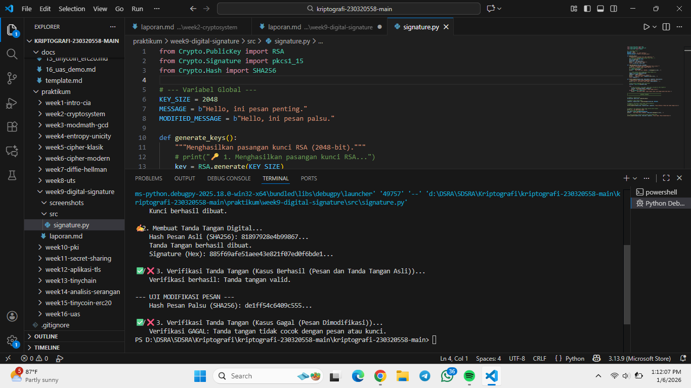

# Laporan Praktikum Kriptografi
Minggu ke-: 9  
Topik: Digital Signature (RSA/DSA)  
Nama: Putri Tripangesti 
NIM: 230320558  
Kelas: 5DSRA

---

## 1. Tujuan
1. Mengimplementasikan tanda tangan digital menggunakan algoritma RSA/DSA.
2. Memverifikasi keaslian tanda tangan digital.
3. Menjelaskan manfaat tanda tangan digital dalam otentikasi pesan dan integritas data.

---

## 2. Dasar Teori
Tanda Tangan Digital adalah mekanisme kriptografi yang digunakan untuk memverifikasi keaslian (authenticity) dan integritas (integrity) suatu dokumen digital atau pesan. Berbeda dengan tanda tangan basah, tanda tangan digital tidak terkait dengan visualisasi, melainkan serangkaian data yang dilekatkan pada pesan, yang dibuat menggunakan kriptografi kunci publik (Public Key Cryptography). Prosesnya melibatkan dua kunci: kunci privat (private key) yang hanya dimiliki oleh penanda tangan untuk membuat tanda tangan, dan kunci publik (public key) yang tersedia untuk umum guna memverifikasi tanda tangan tersebut. Fungsi utamanya adalah memastikan bahwa pesan benar-benar berasal dari penanda tangan yang diklaim (non-repudiation) dan belum diubah setelah ditandatangani.

Dua algoritma utama yang banyak digunakan untuk Tanda Tangan Digital adalah RSA dan DSA (Digital Signature Algorithm). RSA (Rivest-Shamir-Adleman) adalah algoritma serbaguna yang dapat digunakan untuk enkripsi maupun tanda tangan digital. Keamanannya didasarkan pada kesulitan memfaktorkan bilangan besar. Ketika digunakan untuk tanda tangan, penanda tangan mengenkripsi hash pesan menggunakan kunci privatnya. Di sisi lain, DSA adalah algoritma yang dirancang khusus hanya untuk Tanda Tangan Digital. Keamanannya didasarkan pada kesulitan masalah logaritma diskrit (Discrete Logarithm Problem). Meskipun keduanya efektif, DSA umumnya menghasilkan ukuran kunci dan tanda tangan yang lebih pendek, namun DSA tidak dapat digunakan untuk enkripsi. Pilihan antara RSA dan DSA seringkali tergantung pada persyaratan performa, kompatibilitas, dan regulasi spesifik yang berlaku.

---

## 3. Alat dan Bahan
- Visual Studio Code  
- Git dan akun GitHub

---

## 4. Langkah Percobaan
1. Membuat file `signature.py` di folder `praktikum/week9-digital-signature/src/`.
2. Menyalin kode program dari panduan praktikum.
3. Menjalankan program dengan perintah `python signaturer.py`.

---

## 5. Source Code
from Crypto.PublicKey import RSA
from Crypto.Signature import pkcs1_15
from Crypto.Hash import SHA256

# --- Variabel Global ---
KEY_SIZE = 2048
MESSAGE = b"Hello, ini pesan penting."
MODIFIED_MESSAGE = b"Hello, ini pesan palsu."

def generate_keys():
    """Menghasilkan pasangan kunci RSA (2048-bit)."""
    # print("🔑 1. Menghasilkan pasangan kunci RSA...")
    key = RSA.generate(KEY_SIZE)
    private_key = key
    public_key = key.publickey()
    print("    Kunci berhasil dibuat.")
    return private_key, public_key

def sign_message(private_key, message):
    """Membuat tanda tangan digital menggunakan kunci privat."""
    print("\n✍️ 2. Membuat Tanda Tangan Digital...")
    # 1. Hitung hash dari pesan
    h = SHA256.new(message)
    print(f"    Hash Pesan Asli (SHA256): {h.hexdigest()[:16]}...")

    # 2. Tanda tangani hash menggunakan skema PKCS#1 v1.5
    signer = pkcs1_15.new(private_key)
    signature = signer.sign(h)
    print("    Tanda Tangan berhasil dibuat.")
    print(f"    Signature (Hex): {signature.hex()[:32]}...")
    return signature, h

def verify_signature(public_key, hash_object, signature, description):
    """Memverifikasi tanda tangan menggunakan kunci publik."""
    print(f"\n✅/❌ 3. Verifikasi Tanda Tangan ({description})...")
    
    # Kunci publik digunakan untuk verifikasi
    verifier = pkcs1_15.new(public_key)

    try:
        # Coba verifikasi. Jika gagal, akan memicu ValueError atau TypeError
        verifier.verify(hash_object, signature)
        print("    Verifikasi berhasil: Tanda tangan valid.")
    except (ValueError, TypeError):
        print("    Verifikasi GAGAL: Tanda tangan tidak cocok dengan pesan atau kunci.")

# =================================================================
#                         EKSEKUSI PROGRAM
# =================================================================

# Langkah 1: Generate Key
private_key, public_key = generate_keys()

# Langkah 2: Buat Tanda Tangan
signature, original_hash = sign_message(private_key, MESSAGE)

# Langkah 3: Verifikasi Tanda Tangan (Kasus Berhasil)
# Menggunakan hash asli (original_hash)
verify_signature(public_key, original_hash, signature, "Kasus Berhasil (Pesan dan Tanda Tangan Asli)")


# Langkah 4: Uji Integritas (Kasus Gagal karena pesan diubah)
print("\n--- UJI MODIFIKASI PESAN ---")
# 1. Hitung hash dari pesan palsu
fake_hash = SHA256.new(MODIFIED_MESSAGE)
print(f"    Hash Pesan Palsu (SHA256): {fake_hash.hexdigest()[:16]}...")

# 2. Coba verifikasi signature ASLI dengan hash PESAN PALSU
verify_signature(public_key, fake_hash, signature, "Kasus Gagal (Pesan Dimodifikasi)")

---

## 6. Hasil dan Pembahasan


Hasil yang diperoleh sepenuhnya sesuai dengan ekspektasi dan menunjukkan bahwa implementasi Tanda Tangan Digital RSA Anda berfungsi dengan benar.

Kasus Berhasil (Langkah 3): Ekspektasi adalah verifikasi harus berhasil. Tanda tangan dibuat menggunakan kunci privat pengirim pada pesan asli, dan diverifikasi dengan kunci publik yang cocok, membuktikan keaslian (authenticity) dan integritas awal pesan.

Kasus Gagal (Langkah 4): Ekspektasi adalah verifikasi harus gagal. Tujuan dari Tanda Tangan Digital adalah untuk menjamin integritas. Ketika hash dari pesan yang dimodifikasi (MODIFIED_MESSAGE) tidak cocok dengan hash yang terenkripsi di dalam tanda tangan asli, sistem secara kriptografi harus menolak verifikasi. Kegagalan di sini adalah bukti suksesnya fungsi integritas.

---

## 7. Jawaban Pertanyaan
1. Apa perbedaan utama antara enkripsi RSA dan tanda tangan digital RSA?

Jawaban: Perbedaan utama antara enkripsi RSA dan tanda tangan digital RSA terletak pada tujuan keamanan yang dicapai dan penggunaan pasangan kuncinya. Enkripsi RSA bertujuan untuk kerahasiaan (confidentiality): data dikunci menggunakan kunci publik penerima sehingga hanya dapat dibuka oleh kunci privat penerima. Sebaliknya, tanda tangan digital RSA bertujuan untuk otentikasi dan integritas: data (hash dari pesan) dikunci menggunakan kunci privat pengirim, dan diverifikasi menggunakan kunci publik pengirim. Jadi, enkripsi menggunakan kunci publik untuk mengunci dan kunci privat untuk membuka, sementara tanda tangan menggunakan kunci privat untuk "menandatangani" dan kunci publik untuk memverifikasi.


2. Mengapa tanda tangan digital menjamin integritas dan otentikasi pesan?

Jawaban: Tanda tangan digital menjamin integritas dan otentikasi melalui dua mekanisme terpisah. Otentikasi dijamin karena tanda tangan hanya dapat dibuat menggunakan kunci privat yang hanya dimiliki oleh pengirim; jika tanda tangan berhasil diverifikasi oleh kunci publik pengirim, ini membuktikan asal usul pesan tersebut (non-repudiation). Integritas dijamin melalui penggunaan fungsi hash kriptografi sebelum penandatanganan. Tanda tangan dibuat hanya untuk hash pesan (bukan pesan aslinya). Jika pesan diubah walau sedikit oleh pihak ketiga, hash yang dihitung oleh penerima tidak akan cocok dengan hash yang didekripsi dari tanda tangan, sehingga langsung menunjukkan bahwa integritas pesan telah dilanggar.


3. Bagaimana peran Certificate Authority (CA) dalam sistem tanda tangan digital modern?

Jawaban: Dalam sistem tanda tangan digital modern, Certificate Authority (CA) berfungsi sebagai pihak ketiga yang netral dan terpercaya (Trusted Third Party). Peran CA sangat penting karena mengatasi masalah utama kriptografi kunci publik: bagaimana pengguna yakin bahwa kunci publik yang mereka gunakan benar-benar milik orang yang mereka maksud. CA menyelesaikan ini dengan mengikat identitas seseorang (atau server) dengan kunci publik mereka melalui penerbitan Sertifikat Digital (X.509). Sertifikat ini ditandatangani oleh CA itu sendiri, menciptakan Rantai Kepercayaan (Chain of Trust). Dengan memverifikasi sertifikat CA, pengguna dapat mempercayai bahwa kunci publik yang mereka gunakan adalah sah, yang sangat krusial dalam infrastruktur seperti SSL/TLS dan email S/MIME.

---

## 8. Kesimpulan
Kesimpulan dari percobaan implementasi Tanda Tangan Digital RSA ini adalah bahwa sistem berhasil membuktikan kedua fungsi keamanannya: otentikasi dan integritas. Verifikasi berhasil ketika pesan tidak diubah, mengkonfirmasi keaslian pengirim dan keabsahan tanda tangan. Sebaliknya, verifikasi gagal ketika pesan dimodifikasi, yang merupakan bukti sukses bahwa tanda tangan digital efektif dalam mendeteksi adanya gangguan pada integritas pesan.

---

## 9. Daftar Pustaka
-

---

## 10. Commit Log
commit week9-digital-signature
Author: Putri Tripangesti <putritpgst@gmail.com>
Date:   2026-01-06

    week9-digital-signature: implementasi Digital Signature (RSA/DSA) dan laporan 

```
