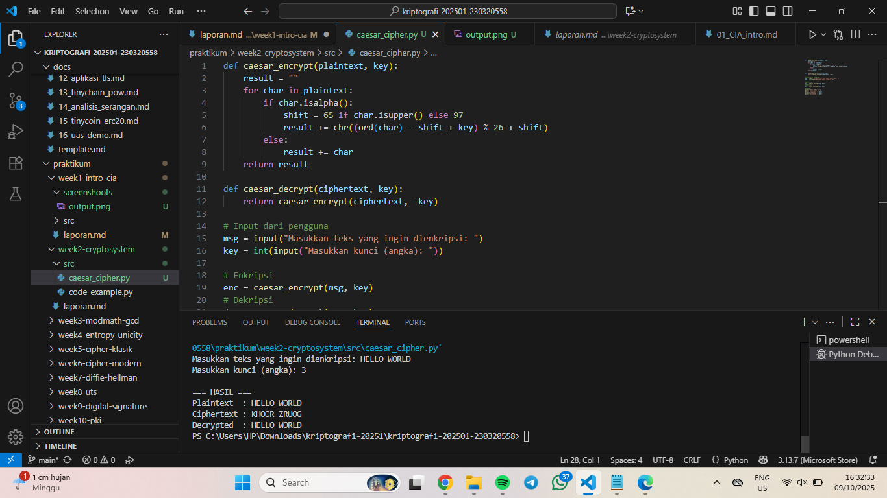
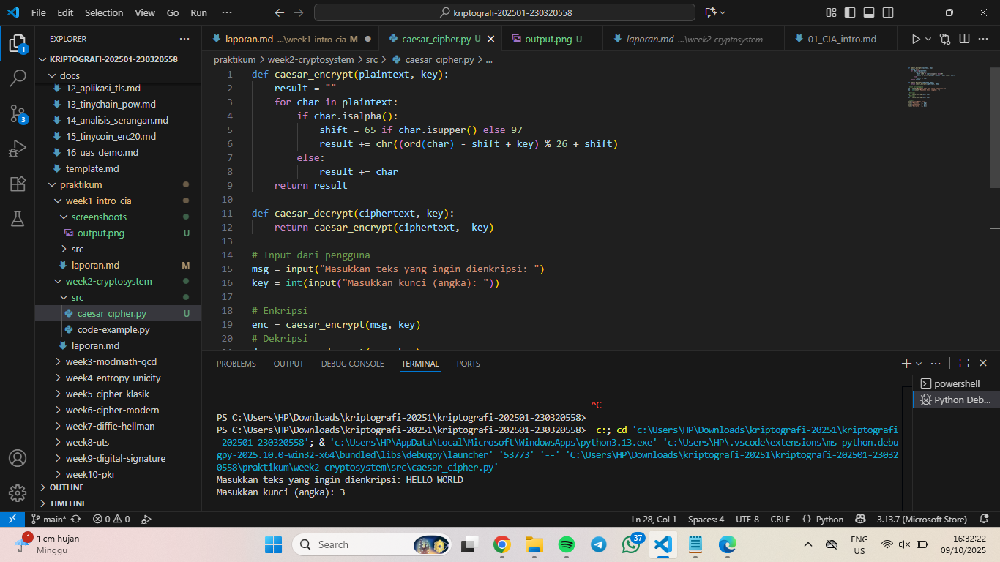

# Laporan Praktikum Kriptografi
Minggu ke-: 1  
Topik: Intro CIA  
Nama: Putri Tripangesti 
NIM: 230320558  
Kelas: 5DSRA  

---

## 1. Tujuan
1. Menjelaskan sejarah dan evolusi kriptografi dari masa klasik hingga modern.  
2. Menyebutkan prinsip Confidentiality, Integrity, Availability (CIA) dengan benar.  
3. Menyimpulkan peran kriptografi dalam sistem keamanan informasi modern.  
4. Menyiapkan repositori GitHub sebagai media kerja praktikum. 

---

## 2. Dasar Teori
Cipher klasik adalah salah satu bentuk awal dari teknik kriptografi yang digunakan untuk menjaga kerahasiaan pesan. Teknik ini sudah ada sejak zaman kuno dan dilakukan secara manual tanpa bantuan komputer. Prinsip dasarnya adalah mengubah pesan asli (*plaintext*) menjadi pesan sandi (*ciphertext*) dengan menggunakan aturan tertentu, sehingga hanya pihak yang mengetahui kunci atau metode penyandiannya yang dapat mengembalikan pesan tersebut ke bentuk aslinya.

Metode yang digunakan dalam cipher klasik umumnya bersifat sederhana, seperti substitusi (penggantian huruf dengan huruf lain) dan transposisi (penukaran posisi huruf dalam pesan). Contohnya adalah Caesar Cipher, yang menggeser setiap huruf dengan jarak tertentu dalam alfabet, serta Vigenère Cipher, yang menggunakan kata kunci untuk menentukan besar pergeseran tiap huruf. Meskipun sederhana, pada masanya cipher klasik cukup efektif untuk menjaga kerahasiaan komunikasi.

Namun, seiring perkembangan teknologi, cipher klasik dianggap kurang aman karena mudah dipecahkan dengan teknik analisis frekuensi dan komputasi modern. Meski demikian, konsep dasar dari cipher klasik tetap menjadi fondasi penting dalam pengembangan sistem kriptografi modern yang digunakan hingga saat ini.

---

## 3. Alat dan Bahan
- Visual Studio Code
- Git dan akun GitHub.

---

## 4. Langkah Percobaan
1. Membuat file `caesar_cipher.py` di folder `praktikum/week2-cryptosystem/src/`.
2. Menyalin kode program dari panduan praktikum.
3. Menjalankan program dengan perintah `python caesar_cipher.py`.

---

## 5. Source Code
def caesar_encrypt(plaintext, key):
    result = ""
    for char in plaintext:
        if char.isalpha():
            shift = 65 if char.isupper() else 97
            result += chr((ord(char) - shift + key) % 26 + shift)
        else:
            result += char
    return result

def caesar_decrypt(ciphertext, key):
    return caesar_encrypt(ciphertext, -key)

msg = input("Masukkan teks yang ingin dienkripsi: ")
key = int(input("Masukkan kunci (angka): "))

enc = caesar_encrypt(msg, key)
dec = caesar_decrypt(enc, key)

print("\n=== HASIL ===")
print("Plaintext  :", msg)
print("Ciphertext :", enc)
print("Decrypted  :", dec)

---

## 6. Hasil dan Pembahasan
Hasil eksekusi program Caesar Cipher:





Penjelasan Hasil: 
Plaintext: HELLO WORLD
Kunci: 3
Ciphertext: KHOOR ZRUOG
            → Setiap huruf digeser 3 posisi ke kanan dalam alfabet (contoh: H→K, E→H, L→O, O→R).
Decrypted: HELLO WORLD
            → Teks berhasil dikembalikan ke bentuk semula dengan kunci yang sama.
Artinya: Proses enkripsi dan dekripsi bekerja sesuai teori Caesar Cipher, hasilnya sesuai ekspektasi.

---

## 7. Jawaban Pertanyaan
- Pertanyaan 1: "Bapak Kriptografi Modern" adalah julukan yang diberikan kepada Claude Shannon, seorang insinyur dan matematikawan yang meletakkan dasar bagi teori informasi dan kriptografi modern melalui makalahnya tahun 1948, "Teori Komunikasi Matematika".
- Pertanyaan 2: - RSA (Rivest–Shamir–Adleman), salah satu algoritma paling terkenal dan digunakan dalam banyak 
sistem keamanan, seperti HTTPS dan email terenkripsi. 
                - ECC (Elliptic Curve Cryptography), lebih efisien dari RSA dengan ukuran kunci yang lebih kecil tapi tingkat keamanan sama. Banyak digunakan di perangkat mobile dan IoT.
                - Diffie–Hellman Key Exchange, digunakan untuk pertukaran kunci secara aman melalui jaringan publik.
                - ElGamal, digunakan dalam sistem tanda tangan digital seperti DSA (Digital Signature Algorithm).
- Pertanyaan 3: Kriptografi klasik menggunakan satu kunci yang sama untuk proses enkripsi dan dekripsi, sehingga termasuk dalam sistem kunci simetris. Sementara itu, kriptografi modern umumnya menggunakan dua kunci berbeda, yaitu kunci publik dan kunci privat, yang disebut kunci asimetris.

Dari segi teknik, kriptografi klasik biasanya berfokus pada penggantian (substitusi) atau penyusunan ulang (transposisi) huruf dalam pesan teks. Contohnya seperti Caesar Cipher atau Vigenère Cipher. Sebaliknya, kriptografi modern bekerja menggunakan konsep matematis yang kompleks, seperti teori bilangan, logaritma diskrit, dan kurva eliptik, untuk menjaga keamanan data digital.

Selain itu, kriptografi klasik hanya cocok untuk pesan berbentuk teks alfabet, sedangkan kriptografi modern digunakan untuk data digital dalam bentuk bit atau biner. Dari sisi keamanan, sistem klasik lebih mudah dipecahkan dengan teknik seperti analisis frekuensi, sementara sistem modern jauh lebih kuat karena berbasis pada perhitungan matematis yang sulit diuraikan tanpa kunci yang benar.

---

## 8. Kesimpulan
Program Caesar Cipher berhasil mengenkripsi dan mendekripsi teks dengan benar menggunakan pergeseran huruf sebanyak 3. Hasil dekripsi identik dengan plaintext awal, sehingga dapat disimpulkan bahwa implementasi algoritma Caesar Cipher ini berfungsi sesuai teori dan ekspektasi.

---

## 9. Daftar Pustaka
(Cantumkan referensi yang digunakan.  
Contoh:  
- Katz, J., & Lindell, Y. *Introduction to Modern Cryptography*.  
- Stallings, W. *Cryptography and Network Security*.  )

---

## 10. Commit Log

commit week1-intro-cia
Author: Putri Tripangesti <putritpgst@gmail.com>
Date:   2025-10-09

    week1-intro-cia: implementasi Caesar Cipher dan laporan.

```
