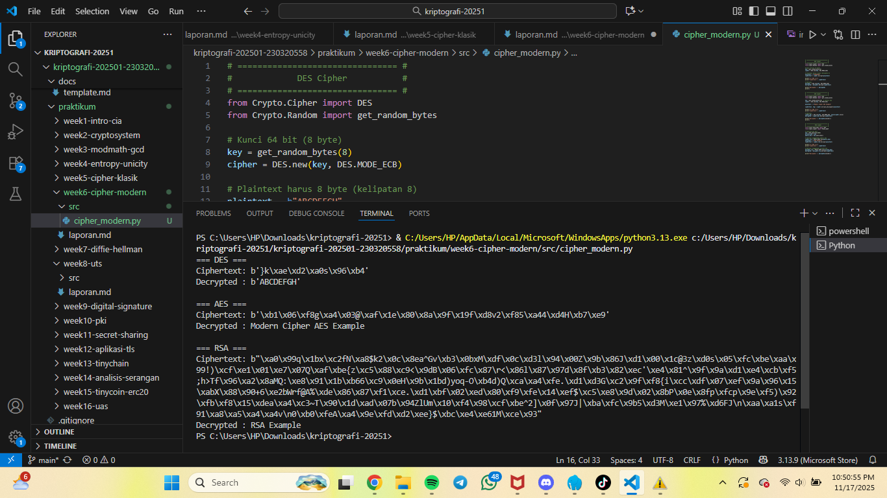

# Laporan Praktikum Kriptografi
Minggu ke-: 6
Topik: Cipher Modern (DES, AES, RSA)  
Nama: Putri Tripangesti  
NIM: 230320558 
Kelas: 5DSRA 

---

## 1. Tujuan
1. Mengimplementasikan algoritma DES untuk blok data sederhana.
2. Menerapkan algoritma AES dengan panjang kunci 128 bit.
3. Menjelaskan proses pembangkitan kunci publik dan privat pada algoritma RSA.

---

## 2. Dasar Teori
Cipher modern dikembangkan untuk mengatasi kelemahan cipher klasik dan memberikan tingkat keamanan yang jauh lebih tinggi. DES (Data Encryption Standard) adalah algoritma enkripsi simetris yang pernah menjadi standar internasional, menggunakan kunci 56-bit dan bekerja dalam struktur Feistel. Meskipun aman pada masanya, ukuran kuncinya yang relatif pendek membuat DES akhirnya digantikan karena rentan terhadap brute force.

Sebagai penerusnya, AES (Advanced Encryption Standard) menjadi standar enkripsi modern yang paling banyak digunakan hingga sekarang. AES menggunakan kunci 128, 192, atau 256-bit dan bekerja dengan operasi substitusi, permutasi, dan transformasi blok yang sangat efisien. Keunggulannya adalah kecepatan, keamanan yang kuat, serta implementasi yang fleksibel pada berbagai perangkat, dari komputer hingga perangkat IoT.

Sementara itu, RSA merupakan algoritma enkripsi asimetris yang menggunakan pasangan kunci publik dan kunci privat. Keamanannya bergantung pada kesulitan faktorisasi bilangan besar, sehingga sangat cocok untuk digital signature, pertukaran kunci, dan autentikasi. Dengan kombinasi cipher simetris (seperti AES) dan asimetris (seperti RSA), sistem keamanan modern mampu memberikan penyandian data yang kuat, efisien, dan terpercaya.

---

## 3. Alat dan Bahan  
- Visual Studio Code 
- Git dan akun GitHub 

---

## 4. Langkah Percobaan
1. Membuat file `cipher_modern.py` di folder `praktikum/week6-cipher_modern/src/`.
2. Menyalin kode program dari panduan praktikum.
3. Menjalankan program dengan perintah `python cipher_modern.py`.

---

## 5. Source Code
# ================================ #
#             DES Cipher           #
# ================================ #
from Crypto.Cipher import DES
from Crypto.Random import get_random_bytes

# Kunci 64 bit (8 byte)
key = get_random_bytes(8)
cipher = DES.new(key, DES.MODE_ECB)

# Plaintext harus 8 byte (kelipatan 8)
plaintext = b"ABCDEFGH"
ciphertext = cipher.encrypt(plaintext)

print("=== DES ===")
print("Ciphertext:", ciphertext)

# Dekripsi
decipher = DES.new(key, DES.MODE_ECB)
decrypted = decipher.decrypt(ciphertext)

print("Decrypted :", decrypted)
print()


# ================================ #
#             AES Cipher           #
# ================================ #
from Crypto.Cipher import AES
from Crypto.Random import get_random_bytes

key = get_random_bytes(16)  # 128-bit key
cipher = AES.new(key, AES.MODE_EAX)

plaintext = b"Modern Cipher AES Example"

ciphertext, tag = cipher.encrypt_and_digest(plaintext)

print("=== AES ===")
print("Ciphertext:", ciphertext)

# Dekripsi
cipher_dec = AES.new(key, AES.MODE_EAX, nonce=cipher.nonce)
decrypted = cipher_dec.decrypt(ciphertext)

print("Decrypted :", decrypted.decode())
print()


# ================================ #
#              RSA Cipher          #
# ================================ #
from Crypto.PublicKey import RSA
from Crypto.Cipher import PKCS1_OAEP

# Generate key pair
key = RSA.generate(2048)
private_key = key
public_key = key.publickey()

# Enkripsi menggunakan public key
cipher_rsa = PKCS1_OAEP.new(public_key)
plaintext = b"RSA Example"
ciphertext = cipher_rsa.encrypt(plaintext)

print("=== RSA ===")
print("Ciphertext:", ciphertext)

# Dekripsi menggunakan private key
decipher_rsa = PKCS1_OAEP.new(private_key)
decrypted = decipher_rsa.decrypt(ciphertext)

print("Decrypted :", decrypted.decode())

---

## 6. Hasil dan Pembahasan
Hasil percobaan sudah sesuai ekspektasi, karena setiap algoritma modern (DES, AES, dan RSA) berhasil melakukan proses enkripsi dan dekripsi dengan benar. Ciphertext yang dihasilkan tampil sebagai data biner acak, yang merupakan karakteristik normal pada cipher modern. Selain itu, setiap ciphertext berhasil dikembalikan ke plaintext semula tanpa perubahan, sehingga membuktikan bahwa implementasi ketiga algoritma berjalan sesuai teori dan fungsi yang diharapkan.

Hasil eksekusi program Caesar Cipher:




---

## 7. Jawaban Pertanyaan
1. Apa perbedaan mendasar antara DES, AES, dan RSA dalam hal kunci dan keamanan?
    DES dan AES adalah algoritma kriptografi simetris, artinya proses enkripsi dan dekripsi menggunakan kunci yang sama. DES memakai kunci 56-bit, yang kini dianggap terlalu pendek dan rentan brute force. AES menggunakan kunci 128, 192, atau 256-bit, yang jauh lebih aman karena ruang kuncinya sangat besar. Sebaliknya, RSA adalah algoritma asimetris, yang menggunakan pasangan kunci: kunci publik untuk enkripsi dan kunci privat untuk dekripsi. Keamanannya tidak bergantung pada panjang kunci yang kecil seperti DES atau AES, tetapi pada kesulitan matematis faktorisasi bilangan besar. Dengan demikian, DES paling lemah, AES sangat kuat, dan RSA digunakan untuk skenario berbeda karena konsep kuncinya berbeda.

2. Mengapa AES lebih banyak digunakan dibanding DES di era modern?
    AES lebih banyak digunakan karena secara keamanan dan efisiensi jauh melampaui DES. Kunci DES yang hanya 56-bit dapat ditembus dengan brute force dalam waktu singkat menggunakan perangkat modern, sedangkan AES menawarkan ukuran kunci hingga 256-bit yang membuat serangan brute force secara praktis mustahil. Selain itu, AES dirancang untuk cepat, efisien, dan mudah diimplementasikan di perangkat keras maupun perangkat lunak. Standarisasi oleh NIST juga membuat AES menjadi algoritma simetris utama yang digunakan industri, menggantikan DES sepenuhnya.

3. Mengapa RSA dikategorikan sebagai algoritma asimetris, dan bagaimana proses pembangkitan kuncinya?
    RSA dikategorikan sebagai algoritma asimetris karena menggunakan dua kunci berbeda yang saling terkait: kunci publik untuk enkripsi dan kunci privat untuk dekripsi. Kunci tersebut dihasilkan melalui proses matematis yang bergantung pada faktorisasi bilangan prima besar. Prosesnya meliputi pemilihan dua bilangan prima besar, menghitung nilai modulus 𝑛, menentukan nilai eksponen publik 𝑒, dan menghitung kunci privat 𝑑 menggunakan invers modulo. Karena hanya pemilik kunci privat yang mengetahui faktor prima dari 𝑛, keamanan RSA sangat bergantung pada sulitnya memfaktorkan bilangan besar tersebut. Ini menjadikan RSA ideal untuk pertukaran kunci dan tanda tangan digital.

---

## 8. Kesimpulan
Berdasarkan percobaan, dapat disimpulkan bahwa ketiga algoritma DES, AES, dan RSA berhasil melakukan proses enkripsi dan dekripsi sesuai mekanisme masing-masing, sehingga output plaintext kembali sama dengan input awal. Hasil ini menunjukkan bahwa implementasi kode telah berjalan sesuai ekspektasi dan setiap algoritma berfungsi sebagaimana konsep teorinya. Selain itu, percobaan membuktikan perbedaan karakteristik antara cipher simetris (DES, AES) dan asimetris (RSA) dalam praktik.

---

## 9. Daftar Pustaka
(Cantumkan referensi yang digunakan.  
Contoh:  
- Katz, J., & Lindell, Y. *Introduction to Modern Cryptography*.  
- Stallings, W. *Cryptography and Network Security*.  )

---

## 10. Commit Log

commit week6-cipher-modern
Author: Putri Tripangesti <putritpgst@gmail.com>
Date:   2025-11-17

    week6-cipher_modern: implementasi cipher modern dan laporan 

```
